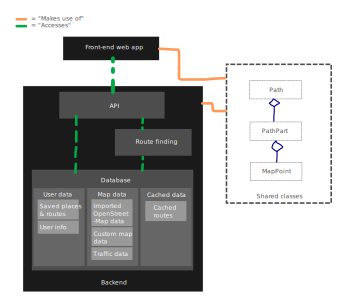

# High level project structure

This document outlines an initial plan for the main components of my NEA, and how these will interact.

## The frontend

The frontend will be a web app built using JavaScript, HTML5 and CSS3 technologies. It will
- Display a map that is scalable and translateable
- Communicate with the backend using an API
- Support a variety of devices such as desktops, tablets and smartphones

It will share many of the data structures that are used on the backend representing map elements and paths. It will require extensive testing to be able to ensure it can reliably perform these functions, where serving as a web app will make user testing easier.

## The backend

The backend will be built in JavaScript using the Node.JS framework. At its most basic level, it will:
- Be able to read OpenStreetMap data that will be imported into a database
- Serve this data via an API to the frontend
- Calculate paths and serve this via an API to the frontend

It will therefore require a database and the use of path theory which I will have to research.
