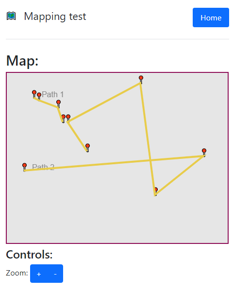
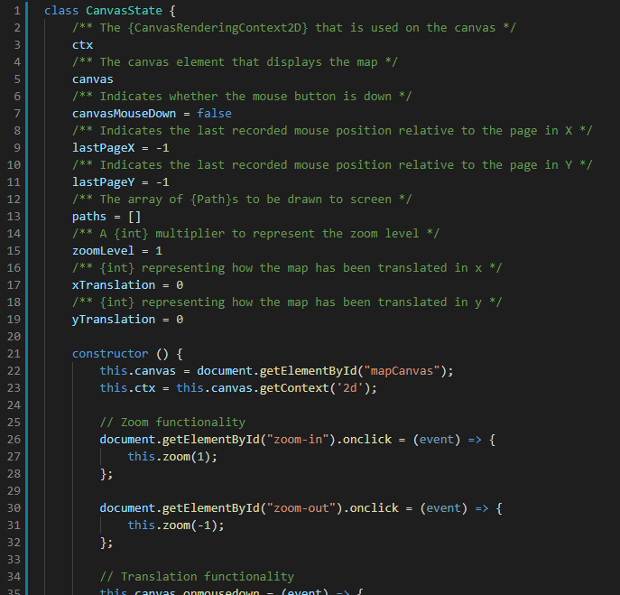

# NEA - Untitled Mapping Project

Code available at: <https://github.com/PeterWarrington/NEA-mapping>

I am working to create a project that is capable of parsing, representing and displaying real-world map data, which can then be used to calculate the most efficient paths between points. This would work in conjunction with a backend API that returns map data to a client, where the backend is responsible for calculating paths and caching these so that they can be returned to clients more quickly.

I believe that a web app built using standard web technology (HTML5, CSS, JS) would be the most effective way to achieve this, as it enables use of the service using one client codebase regardless of device specifics and is well supported by mobiles in particular. This is what I have started to create as part of my mini-project, leaving behind the backend for now so I can build the data structures and build a more simple base from which the rest of the project can be effectively built on. The codebase I have created as it stands is capable of displaying map data to the user given a set of connecting points, where this map is scalable and translatable.

The backend I have built at the moment simply serves the static site that acts as the client, but is and will be built using Node.JS, a backend JavaScript runtime environment that is suited to building APIs and is well used in professional environments. It means that in addition I can reuse the same data structures for both client and server, making transfer and development between the two faster and more efficient such that I do not have to make two separate implementations of two data structures for example. 

I will be using OpenStreetMap data as part of my project, which provides comprehensive, worldwide community built map-data under a freely-usable license given attribution.

Some screenshots are included below:

