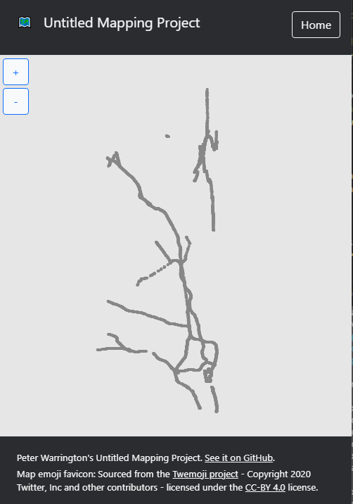

# NEA Analysis

# The problem:
User wants access to a self-hosted mapping platform for their organisation, from which they can import real-world map data and modify this. They want to be able to add things like notes, rough drawings, and would like the ability to calculate paths. This should be accessible on a variety of platforms - Including phones, tablets and desktop computers.

# Proposed solution:
A web-based mapping app that operates on a client-server model, which can import map data in the OpenStreetMap XML format, and return this to web clients from a custom database so that it can be displayed to the user. This can then be used to find paths between points, and where this data can be modified, able to add things like annotations. This will use a authentication system.

# Objectives:
See attached "Project objectives" document.

# Research:
- I have conducted research on the OSM XML file format and the useful information that can be extracted from this, proposing a written alogrithm for how to do this (OSM Conversion algorithm document).
- I have been researching the Bootstrap framework and implementing it so that I can generate UI without spending lots of time worrying about implementation of UI elements. For this I have been making use of the Bootstrap reference from their website.
- I have done some research on path theory, including specifically on Dijkstra's algorithm which I have included in my "Graph theory research" document. This will be used to generate paths given connecting points on a map.

# Proposed solution detail:
- See High level project structure document and diagram for an outline of my initial plan, and how different project elements will interact.
- TODO: Create database layout.

# Current implementation 
At the moment, I have a web client serviced by a basic web server that can display data returned from the backend on a scaleable and translateable map. The server and client use shared classes in order to represent this map data. Large parts of my OSM conversion algorithm have also been implemented, reading OSM points from a ~400MB file (Cambridgeshire) and converting them into instances of my classes, which can then be shown on the client. Displaying this OSM map data is currently buggy however and has some issues, for example some roads seem to be missing and scaling is conducted about map origin making navigating the map difficult.

\newpage
